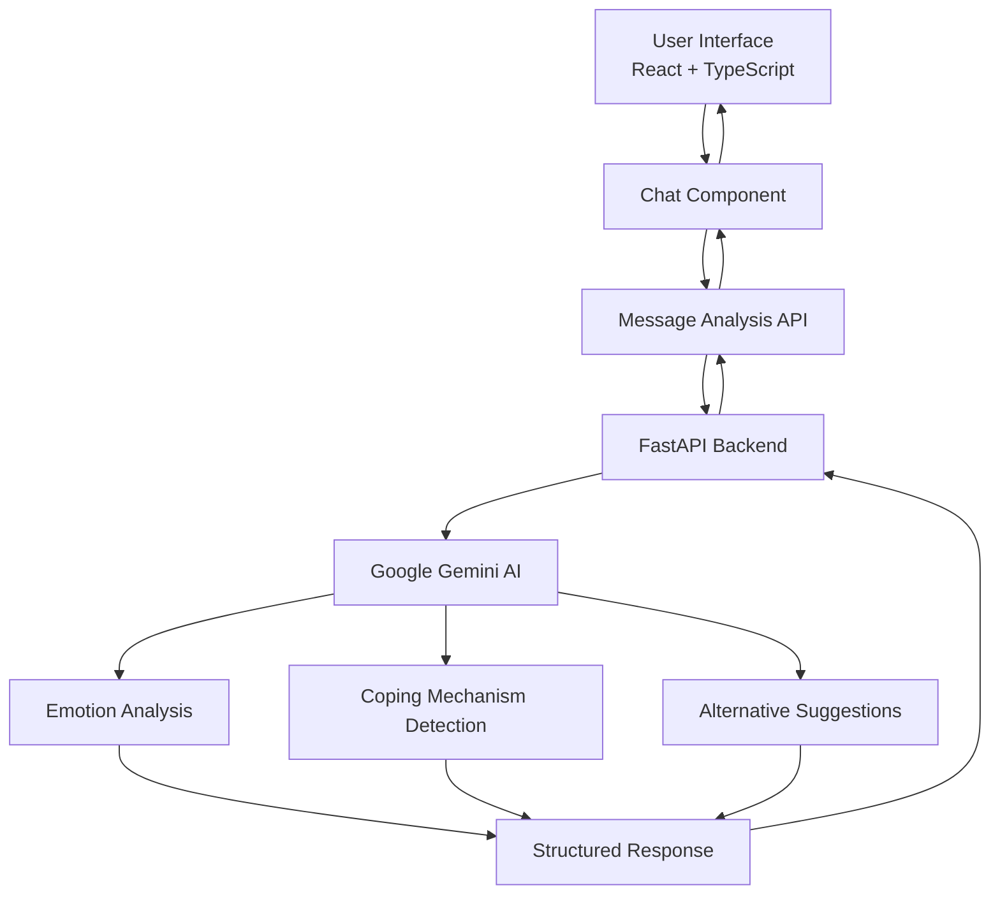
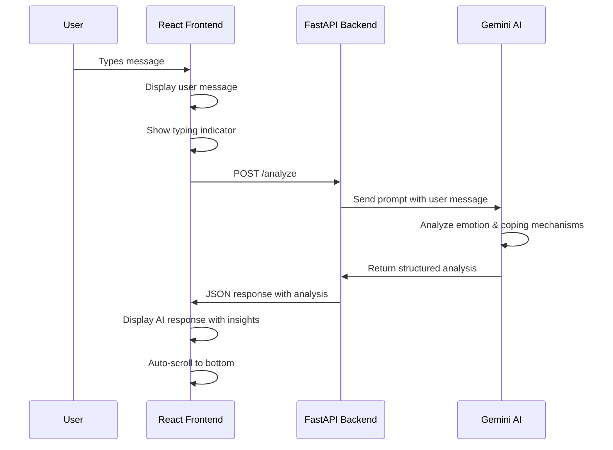
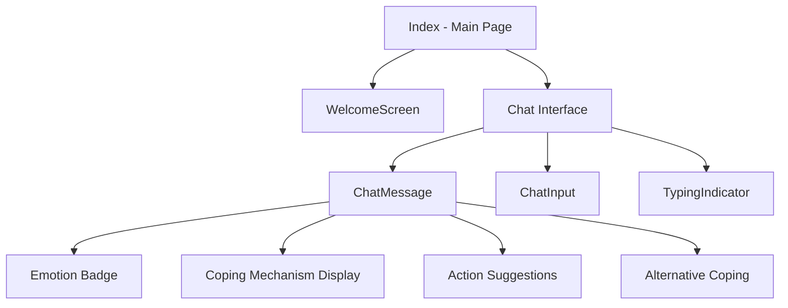

# MindfulAI - AI-Powered Mental Health Chat Assistant

MindfulAI is an intelligent chat application that provides emotional support and mental health guidance through AI-powered conversation analysis. The application analyzes user emotions, identifies current coping mechanisms, and suggests healthier alternatives to promote mental wellbeing.

## 🌟 Features

- **Emotion Analysis**: Real-time emotion detection from user messages
- **Coping Mechanism Recognition**: Identifies current coping strategies being used
- **Alternative Suggestions**: Provides healthier coping mechanisms and actionable advice
- **Responsive Design**: Beautiful, accessible interface that works on all devices
- **Real-time Chat**: Smooth conversational experience with typing indicators

## 🏗️ Architecture Overview



## 🛠️ Tech Stack

### Frontend
- **React 18** - Modern React with hooks and functional components
- **TypeScript** - Type-safe development
- **Vite** - Fast build tool and development server
- **Tailwind CSS** - Utility-first CSS framework
- **shadcn/ui** - Beautiful, accessible component library
- **Lucide React** - Icon library
- **React Router** - Client-side routing

### Backend
- **FastAPI** - Modern Python web framework
- **Google Gemini AI** - Advanced language model for emotion analysis
- **Python 3.11+** - Backend runtime
- **CORS Middleware** - Cross-origin resource sharing

### Development Tools
- **ESLint** - Code linting
- **PostCSS** - CSS processing
- **Node.js & npm** - Package management

## 🔄 Application Flow



## 📁 Project Structure

```
src/
├── components/
│   ├── ui/                 # shadcn/ui components
│   ├── ChatMessage.tsx     # Individual message component
│   ├── ChatInput.tsx       # Message input component
│   ├── TypingIndicator.tsx # Loading animation
│   └── WelcomeScreen.tsx   # Landing screen
├── pages/
│   ├── Index.tsx          # Main chat interface
│   └── NotFound.tsx       # 404 page
├── hooks/
│   └── use-toast.ts       # Toast notification hook
├── lib/
│   └── utils.ts           # Utility functions
└── main.tsx               # Application entry point
```

## 🚀 Getting Started

### Prerequisites
- Node.js 18+ and npm
- Python 3.11+
- Google Gemini API key

### Frontend Setup

1. Clone the repository:
```bash
git clone <repository-url>
cd mindful-ai
```

2. Install dependencies:
```bash
npm install
```

3. Start the development server:
```bash
npm run dev
```

The frontend will be available at `http://localhost:5173`

### Backend Setup

1. Navigate to your backend directory and install dependencies:
```bash
pip install fastapi uvicorn google-generativeai python-dotenv
```

2. Create a `.env` file with your Gemini API key:
```bash
GEMINI_API_KEY=your_api_key_here
```

3. Run the FastAPI server:
```bash
uvicorn main:app --reload --host 0.0.0.0 --port 8000
```

The backend API will be available at `http://localhost:8000`

## 🔧 API Endpoints

### POST `/analyze`
Analyzes user input and returns emotional insights.

**Request Body:**
```json
{
  "thought": "User's message text"
}
```

**Response:**
```json
{
  "response": "AI response message",
  "emotion": "detected_emotion",
  "coping_mechanism": "current_coping_strategy", 
  "action": "suggested_action",
  "alternative_coping": "healthier_alternative"
}
```

## 🎨 Component Architecture



## 🌐 Deployment

Both frontend and backend are deployed on **Render**.

### Live Application
- **Frontend**: https://mindfulai-frontend.onrender.com/
- **Backend**: https://mindfulai-backend.onrender.com/

### Render Deployment Setup

#### Frontend Deployment
1. Connect your GitHub repository to Render
2. Create a new Web Service
3. Set build command: `npm install && npm run build`
4. Set start command: `npm run preview` or use a static site service
5. Set environment to Node.js

#### Backend Deployment  
1. Create a new Web Service for the FastAPI backend
2. Set build command: `pip install -r requirements.txt`
3. Set start command: `uvicorn main:app --host 0.0.0.0 --port $PORT`
4. Add environment variable: `GEMINI_API_KEY=your_api_key_here`
5. Configure CORS origins to include your frontend domain

## 🔒 Environment Variables

### Backend
- `GEMINI_API_KEY` - Your Google Gemini AI API key

## 🤝 Contributing

1. Fork the repository
2. Create a feature branch: `git checkout -b feature-name`
3. Commit changes: `git commit -am 'Add feature'`
4. Push to branch: `git push origin feature-name`
5. Submit a pull request
